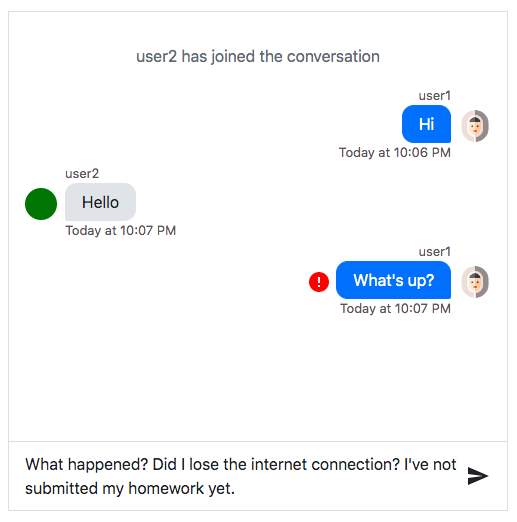

# react-chat-plugin

This is an easy-to-use react chat window library. 



## Features
1. Simple and clean UI.
2. Two different types of messages: `text` or `notification`
3. Error icon
5. Extendable input area
6. Support new line in the input
7. Key board action: `shift + enter` to send the message

## Install
```shell
npm install react-chat-plugin --save
```

## Import
```javascript
import ChatBox from 'react-chat-plugin';

state = {
    messages: [
        {
            'text': 'user2 has joined the conversation',
            'timestamp': 1578366389250,
            'type': 'notification'
        },
        {
            'author': {'username': 'user1', 'id': 1, 'avatarUrl': 'https://image.flaticon.com/icons/svg/2446/2446032.svg'},
            'text': 'Hi',
            'type': 'text',
            'timestamp': 1578366393250,
        },
        {
            'author': {'username': 'user2', 'id': 2, 'avatarUrl': null},
            'text': 'Hello',
            'type': 'text',
            'timestamp': 1578366425250,
        },
        {
            'author': {'username': 'user1', 'id': 1, 'avatarUrl': 'https://image.flaticon.com/icons/svg/2446/2446032.svg'},
            'text': 'What\'s up?',
            'type': 'text',
            'timestamp': 1578366425250,
            'hasError': true
        }
    ]
}

handleOnSendMessage = (message) => {
    this.setState({
        messages: this.state.messages.concat({
            author: {'username': 'user1', 'id': 1, 'avatarUrl': 'https://image.flaticon.com/icons/svg/2446/2446032.svg'},
            text: message,
            timestamp: +new Date(),
            type: 'text'
        })
    });
}

<ChatBox
    messages={this.state.messages}
    userId={1}
    onSendMessage={this.handleOnSendMessage}
    width={'500px'}
    height={'500px'}
/>
```

## props
| prop | default | type | required |
| ---- | ---- | ---- | ---- |
| messages | [] | string | N |
| userId | null | string/number | Y |
| onSendMessage | null | function | Y |
| width | 400px | string | N |
| height | 60vh | string | N |


