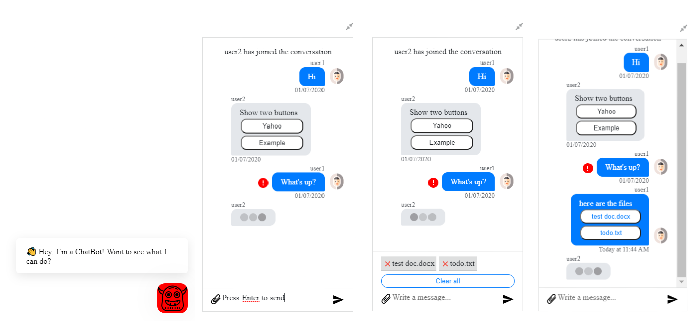

# react-chat-plugin

[](https://circleci.com/gh/leon0707/react-chat-plugin)
[](https://www.npmjs.com/package/react-chat-plugin)
[](https://snyk.io/test/github/leon0707/react-chat-plugin?targetFile=package.json)

This is an easy-to-use react chat plugin.


### [changelog](./changelog.md)

## Features
1. Simple and clean UI
2. Good for chatbot or person to person chat
3. Two different types of messages: `text` or `notification`
4. Error icon
5. Typing indicator
6. Extendable input area
7. Support new line in the input
8. Key board action: `enter` to send message; `shift + enter` to insert new line
9. Send files along messages

## Install
```shell
npm install @ergisgjergji/react-chat-plugin --save
```

## Run example
```shell
npm start
```

## Import
```javascript
import ChatBox, { ChatFrame } from 'react-chat-plugin';

state = {
  messages: [
    {
      text: 'user2 has joined the conversation',
      timestamp: 1578366389250,
      type: 'notification',
    },
    {
      author: {
        username: 'user1',
        id: 1,
        avatarUrl: 'https://image.flaticon.com/icons/svg/2446/2446032.svg',
      },
      text: 'Hi',
      type: 'text',
      timestamp: 1578366393250,
    },
    {
      author: { username: 'user2', id: 2, avatarUrl: null },
      text: 'Show two buttons',
      type: 'text',
      timestamp: 1578366425250,
      buttons: [
        {
          type: 'URL',
          title: 'Yahoo',
          payload: 'http://www.yahoo.com',
        },
        {
          type: 'URL',
          title: 'Example',
          payload: 'http://www.example.com',
        },
      ],
    },
    {
      author: {
        username: 'user1',
        id: 1,
        avatarUrl: 'https://image.flaticon.com/icons/svg/2446/2446032.svg',
      },
      text: "What's up?",
      type: 'text',
      timestamp: 1578366425250,
      hasError: true,
    },
  ],
};

const handleOnSendMessage = (message, files = []) => {
    /*
      In this example, we are receiving the actual files.
      In a real-world scenario, you would post the message, along with the files, to an endpoint/websocket,
      and from the result, you would receive, for example, the link to the file you sent, along with other information, and you would
      work with the link.
      So, in this simple example, I fake a link/url for each file, using: URL.createObjectURL()
    */

    let currMessage = {
      author: {
        username: 'user1',
        id: 1,
        avatarUrl: 'https://image.flaticon.com/icons/svg/2446/2446032.svg',
      },
      text: message,
      type: 'text',
      timestamp: +new Date()
    };

    if(files && files.length > 0) {
      let buttons = []

      for(let i = 0; i < files.length; i++) {
        buttons.push({
          type: 'URL',
          title: files[i].name,
          payload: URL.createObjectURL(files[i])
        })
      }

      currMessage.buttons = buttons;
    }

    setAttr({...attr, messages: [...attr.messages, currMessage]});
  };

const handleOnMessageButtonClick = (payload) => {
    alert(`Clicked: ${payload}`);
  }

<ChatBox
  messages={this.state.messages}
  userId={1}
  onSendMessage={this.handleOnSendMessage}
  onMessageButtonClick={handleOnMessageButtonClick}
  width={'500px'}
  height={'500px'}
  fileSelectMode='MULTIPLE'
/>;
```

### With frame

```javascript
import ChatBox, { ChatFrame } from 'react-chat-plugin';

function Example() {

  const [attr, setAttr] = useState({
    showChatbox: false,
    showIcon: true,
    messages: [
      {
        text: 'user2 has joined the conversation',
        timestamp: 1578366389250,
        type: 'notification',
      },
      {
        author: {
          username: 'user1',
          id: 1,
          avatarUrl: 'https://image.flaticon.com/icons/svg/2446/2446032.svg',
        },
        text: 'Hi',
        type: 'text',
        timestamp: 1578366393250,
      },
      {
        author: { username: 'user2', id: 2, avatarUrl: null },
        text: 'Show two buttons',
        type: 'text',
        timestamp: 1578366425250,
        buttons: [
          {
            type: 'URL',
            title: 'Yahoo',
            payload: 'http://www.yahoo.com',
          },
          {
            type: 'URL',
            title: 'Example',
            payload: 'http://www.example.com',
          },
        ],
      },
      {
        author: {
          username: 'user1',
          id: 1,
          avatarUrl: 'https://image.flaticon.com/icons/svg/2446/2446032.svg',
        },
        text: "What's up?",
        type: 'text',
        timestamp: 1578366425250,
        hasError: true,
      },
    ],
  });
  
  const handleClickIcon = () => {
    // toggle showChatbox and showIcon
    setAttr({
      ...attr,
      showChatbox: !attr.showChatbox,
      showIcon: !attr.showIcon,
    });
  };
  
  const handleOnSendMessage = (message, files = []) => {
    /*
      In this example, we are receiving the actual files.
      In a real-world scenario, you would post the message, along with the files, to an endpoint/websocket,
      and from the result, you would receive, for example, the link to the file you sent, along with other information, and you would
      work with the link.
      So, in this simple example, I fake a link/url for each file, using: URL.createObjectURL()
    */

    let currMessage = {
      author: {
        username: 'user1',
        id: 1,
        avatarUrl: 'https://image.flaticon.com/icons/svg/2446/2446032.svg',
      },
      text: message,
      type: 'text',
      timestamp: +new Date()
    };

    if(files && files.length > 0) {
      let buttons = []

      for(let i = 0; i < files.length; i++) {
        buttons.push({
          type: 'URL',
          title: files[i].name,
          payload: URL.createObjectURL(files[i])
        })
      }

      currMessage.buttons = buttons;
    }

    setAttr({...attr, messages: [...attr.messages, currMessage]});
  };
  
  const handleOnMessageButtonClick = (payload) => {
    alert(`Clicked: ${payload}`);
  }
  
  return (
    <ChatFrame
      chatbox={
        <ChatBox
          onSendMessage={handleOnSendMessage}
          onMessageButtonClick={handleOnMessageButtonClick}
          userId={1}
          messages={attr.messages}
          width={'300px'}
          showTypingIndicator={true}
          activeAuthor={{ username: 'user2', id: 2, avatarUrl: null }}
          fileSelectMode='MULTIPLE'
        />
      }
      icon={<RobotIcon className="Icon" />}
      clickIcon={handleClickIcon}
      showChatbox={attr.showChatbox}
      showIcon={attr.showIcon}
      iconStyle={{ background: 'red', fill: 'white' }}
    >
      <div className="Greeting" style={{ width: '300px' }}>
        👋 Hey, I’m a ChatBot! Want to see what I can do?
      </div>
    </ChatFrame>
  );
}
```

## props
| prop | default | type | required | description |
| ---- | ---- | ---- | ---- | ---- |
| messages | [] | array | N |   |
| userId | null | string/number | Y |   |
| onSendMessage | null | function | Y |   |
| onMessageButtonClick | null | function | Y | A handler for when you click a message button. Takes as parameter the button's payload. |
| timestampFormat | `calendar` | [`calendar`, `fromNow`, `MMMM Do YYYY, h:mm:ss a`] | N |   |
| fileSelectMode | `MULTIPLE` | [`SINGLE`, `MULTIPLE`, `DISABLED`] | N | Determines whether you want the ability to select file(s). |
| width | 400px | string | N |   |
| height | 60vh | string | N |   |
| disableInput | false | bool | N |   |
| showTypingIndicator | false | bool | N |   |
| activeAuthor | null | object | N |   |
| labels | `{ placeholder: "Write a message...", disabledPlaceholder: "", clearFiles: "Clear all", everyone: "Everyone", to: "To", private: "private" }` | object | N | The translation should be handled by the consumers of this package. The consumers should pass the translated `messages`. The package simply prints the text by using the `keys` of the `messages`. |
